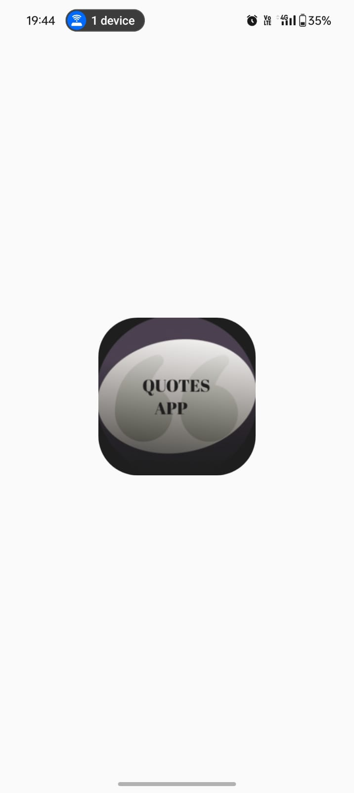
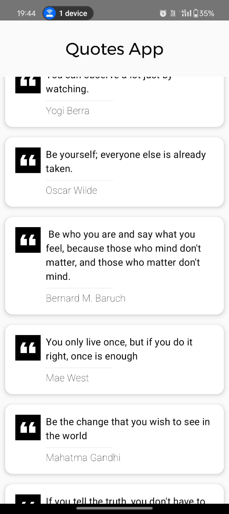

# 📜 Quotes App

A simple and elegant Android application that displays inspiring and motivational quotes. This project aims to provide users with a seamless and beautiful way to explore quotes and stay motivated throughout the day.

## ✨ Features

- 📋 Displays a predefined list of fixed quotes
- 👉 On clicking, navigates to a new screen to view the quote in detail
- 🔁 Navigate through quotes in a simple and clean UI
- 🌓 Light/Dark mode support (optional enhancement)

## 📸 Screenshots

### Quotes App

### Home Page

### Detail Screen

## 🚀 Tech Stack
- Kotlin
- Jetpack Compose
- ViewModel Architecture
- Material Design 3
